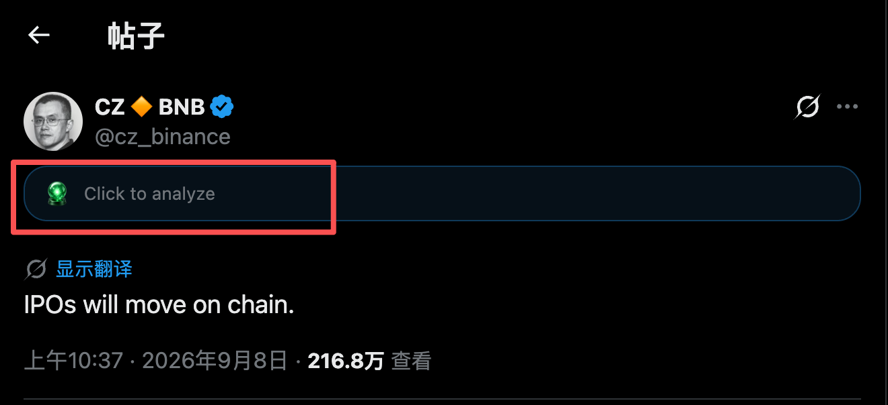
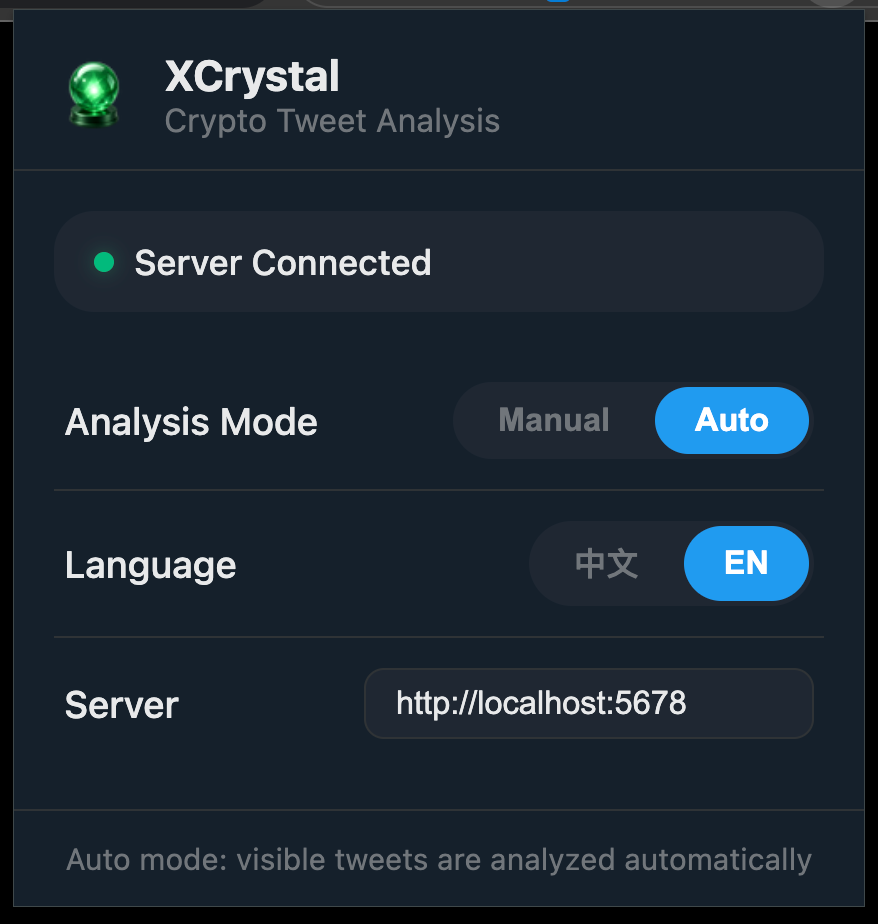

# XCrystal 

[English](README.md) | [中文](README.zh-CN.md)

[Laya](https://github.com/NandhaKishorM/laya) 驱动的 X (Twitter) 加密货币分析 Chrome 扩展，以及运行在 `localhost:5678` 的本地分析服务。

> 💡 **Jev 的开源替代** — 基于 Laya，免费本地运行

**🆓 纯本地，0 费用** — 分析在本机完成

**⚡ 响应快** — 本地推理，模型不经云端

<p align="center">
  
</p>
<p align="center"><em>推文上的分析条：相关性 %、范围、方向、影响。</em></p>

## 是什么

**XCrystal** 由两部分组成：

1. **Chrome MV3 扩展**（`xcrystal_extension/`）— 在 X/Twitter 推文上注入分析条，拦截 GraphQL 获取完整正文（含长推文 note），并请求本机 `127.0.0.1:5678` 上的分析服务。
2. **本地 Laya 分析服务**（本仓库中的 `server.py`）— Flask + flask-cors，默认 `http://127.0.0.1:5678`。对每条推文给出加密货币 **相关性**、**范围**、**方向**、**影响**。

## 目录结构

```
./                             # 项目 / 仓库根目录（服务端在此）
├── README.md / README.zh-CN.md
├── LICENSE                    # MIT
├── requirements.txt           # 锁定的 Python 依赖
├── assets/                    # README 截图与 icon.png
├── server.py                  # API 服务（Flask）
├── start.sh                   # 启动服务（从 env / .env 读取 VENV_PATH）
├── .env.example               # 复制为 .env（已被 gitignore）
├── crypto_tickers.txt         # cashtag 白名单（规则层）
├── laya_config.py             # 脚本共用的 LAYA_MODEL_PATH 辅助模块
├── prompt_tests/              # 评测与推文集（见 prompt_tests/README.md）
└── xcrystal_extension/        # 仅 Chrome 扩展
    ├── manifest.json
    ├── background.js          # API 代理 + 客户端缓存
    ├── content.js             # 推文条 + 自动/手动模式
    ├── page_hook.js           # MAIN 世界 GraphQL 拦截
    ├── popup.html / popup.js
    ├── i18n.js
    ├── styles.css
    ├── config.json
    └── icons/
```

## 安装与启动

### 环境要求

- 建议 Python 3.10+（本仓库在 **Python 3.14** 上开发/测试；3.9 或可用但未在此验证）
- Chrome
- 本机已下载的 Laya 多语言模型
- Python 虚拟环境（见下方；`./start.sh` 读取 `VENV_PATH`）

### 硬件参考

| 组件 | 最低 | 推荐 |
|------|------|------|
| 内存 | 8GB | 16GB+ |
| GPU | CUDA / Apple MPS | Apple Silicon / NVIDIA |
| 存储 | 模型约 2GB+ | — |

### 1. 虚拟环境与依赖

```bash
python3 -m venv .venv
source .venv/bin/activate   # Windows: .venv\Scripts\activate
pip install -r requirements.txt
# 锁定：laya==0.3.11、flask==3.1.3、flask-cors==6.0.5
```

### 2. 模型

```bash
# 国内可选镜像
export HF_ENDPOINT=https://hf-mirror.com

hf download convaiinnovations/laya --include "multilingual/**" --local-dir ./models
# → ./models/multilingual/
```

也可将 `LAYA_MODEL_PATH` 设为本地目录（例如 `/path/to/laya/multilingual`），或 `laya.load` 可接受的 Hugging Face 仓库 id（例如 `convaiinnovations/laya`）。

### 3. 配置 `.env`

```bash
cp .env.example .env
# 编辑 LAYA_MODEL_PATH 等
```

| 变量 | 说明 | 示例 |
|------|------|------|
| `LAYA_MODEL_PATH` | 本地模型目录或 `laya.load` 可用的 HF 仓库 id | `/path/to/laya/multilingual` |
| `VENV_PATH` | `./start.sh` 使用的虚拟环境 | `.venv` |
| `SERVER_HOST` | 监听地址 | `127.0.0.1` |
| `SERVER_PORT` | 端口 | `5678` |
| `CACHE_SIZE` | 服务端 LRU 缓存条数 | `1000` |
| `LOG_FILE` | 日志文件（相对路径则相对 `server.py`） | `server.log` |
| `URL_PREPROCESS` | 推理前 URL 处理模式 | `remove` / `domain` / `off` |
| `LOW_RELEVANCE_GATE` | scope=none 时的封顶/门控阈值 | `0.35` |
| `LAYA_DEVICE` | 可选，传给 `laya.load` 的 device（不设则自动选择） | `mps` / `cuda` / `cpu` |

**环境变量优先于 `.env`。** `./start.sh` 解析虚拟环境的顺序：环境变量 `VENV_PATH` → `.env` 中的 `VENV_PATH` → `./.venv`。推理用 `PREDICT_LOCK` 串行（见 [并发说明](#并发pytorch-mps)）。

### 4. 启动服务

```bash
cd /path/to/repo                 # 项目 / 仓库根目录
./start.sh
# 或：source .venv/bin/activate && python server.py
```

`./start.sh` 会按 `VENV_PATH`（环境变量或 `.env`，默认 `./.venv`）激活虚拟环境，静默确保已安装 `flask` / `flask-cors`，然后执行 `python server.py`。首次搭建请先 `pip install -r requirements.txt`。

**健康检查**（扩展请求本机分析服务；根路径 `/` 无路由）：

```bash
curl -s http://127.0.0.1:5678/health   # 期望 {"status":"ok", ...}
```

### 5. 加载 Chrome 扩展

1. 打开 `chrome://extensions`
2. 开启 **开发者模式**
3. **加载已解压的扩展程序** → 选择 `xcrystal_extension` 目录
4. 修改扩展文件后，在扩展卡片上点 **重新加载**

默认 API：`http://localhost:5678`（可在弹窗中修改）。

## 四个指标

显示在推文分析条上。文案由 `i18n.js` 中英切换。

| 界面 | 含义 |
|------|------|
| **%（相关 / Relevance）** | 该推文可能影响加密价格的概率。JSON 字段名为 `volatile`（历史命名，**不是**波动率）。 |
| **范围（Scope）** | 仅在相关时有意义。当 `gated` 时，分析条只显示 **无关**，不显示方向/影响。 |
| **方向（Direction）** | bullish / bearish / neutral — 评判的是**事件**本身，不是价格预测。当最大方向概率 &lt; `UNCERTAIN_THRESHOLD`（默认 `0.60`，可通过环境变量 / `.env` 配置）时显示灰色 **不确定 / uncertain**。 |
| **影响（Impact）** | low / medium / high / extreme — **数小时到数日**内可能的波动幅度。 |

### 范围取值

| 值 | 中文 / EN | 含义 |
|----|-----------|------|
| `btc_eth_macro` | 大盘/宏观 / BTC/ETH & macro | BTC、ETH、加密 ETF，或会重定价加密资产的宏观/地缘冲击 |
| `sector` | 板块 / Sector | L2、DeFi、meme、AI-crypto、RWA、稳定币、单条公链 |
| `single_asset` | 单币 / Single asset | 单一代币、协议或交易所 |
| `none` | 无关 / None | 无加密传导 |

### 影响等级示例（来自服务端 prompt）

| 等级 | 示例 |
|------|------|
| **low** | 旧闻重发、点评观点、数据基本符合预期 |
| **medium** | 真实数据超预期、有限区域冲突、中型上币/宕机 |
| **high** | FOMC 意外、突然升级、ETF 资金流冲击、大额解锁、顶级所上币、千万美元级以上黑客、链停摆 |
| **extreme** | 紧急利率操作、系统性战争/制裁冲击、ETF 批准/禁止、交易所偿付危机、稳定币脱锚 |

## 效果预览

| | |
|:--:|:--:|
|  |  |
| *分析完成后的推文条（%、范围、方向、影响）。* | *手动模式：点击水晶图标分析推文。* |

<p align="center">
  
</p>
<p align="center"><em>弹窗：服务连接状态、手动/自动模式、语言、服务器地址（<code>http://localhost:5678</code>）。</em></p>

## 推文提取如何工作

1. **`page_hook.js`** 在 **MAIN** 世界运行（见 `manifest.json`），挂钩 `fetch` / XHR，拦截 X GraphQL 推文接口。
2. 优先使用 `note_tweet` 全文，展开 t.co，并带一层 **引用推文**。
3. **`content.js`** 合并 GraphQL 文本与 DOM 回退；引用内容以 `QT: ...` 追加，使时间线与详情页在 GraphQL 可用时输入一致。
4. 缓存：**background.js** 按推文 `id`（否则按文本）缓存；**server.py** 亦按 `id:` / 文本哈希做 LRU。

## 规则层

模型输出后，`server.py` 中 `apply_collision_rules` 可能压低相关性并强制中性 / `none`：

- **`crypto_tickers.txt`** — 可编辑的 cashtag 白名单。仅出现非白名单 `$TICKER` 且无其它加密关键词 → `cashtag_collision:...`
- **“link in bio”** 等生活方式短句且无加密关键词 → `phrase_collision`
- 命中时：`volatile` 上限 `0.1`，`scope=none`，`direction=neutral`；`rule_flags` 中带标记

## URL 预处理与范围门控

推理前，`server.py` 会去掉推文中的 URL（原文仍用于日志与缓存键）。默认模式为 **`remove`**（`URL_PREPROCESS=remove|domain|off`）：

- **`remove`**（默认）— 删除 `http(s)://…`、`www.…`，以及 `pan.quark.cn/s/…` 这类裸域名路径。选用该模式是因为 URL 路径里的长十六进制会被模型当成交易哈希，相关性被打到接近 1.0。
- **`domain`** — 把每个 URL 替换成 `[link: example.com]`（保留弱域名提示）。
- **`off`** — 不处理。

纯文本里的 `0x…` 合约地址、Solana 地址**不会**被去掉（它们是真实加密信号）；只去掉出现在 URL 内部的 hex。

### 范围门控（scope gating）

当模型给出 `scope=none` 时：

1. 压低相关性：`volatile = min(volatile, 1 - p(none))`。
2. 若推文**没有**加密关键词 / 白名单 cashtag（或已触发碰撞规则），则标记 `gated=true` / `relevant=false`，方向按展示中性处理，并把 `volatile` 再限制在 `LOW_RELEVANCE_GATE`（默认 `0.35`）以下。扩展此时只显示 **%** 与 **无关**。
3. 若存在加密信号，则只做相关性封顶（`rule_flags` 可能含 `scope_vol_cap`），方向/影响仍显示。

**局限：** 小模型仍会高估部分非加密帖（如字面写了 “crypto” 的闲聊、名字里的 “Eth”、西语 “sol”）。URL 清洗 + 门控修好了「URL 内 hex」类误报；关键词碰撞仍不完美。

## 扩展设置

弹窗（`popup.js` + `chrome.storage.local`）：

| 设置 | 取值 | 行为 |
|------|------|------|
| **模式** | 手动 / 自动 | 自动模式下，进入视口的推文会分析（IntersectionObserver），**最多 2 路并发**（`content.js` 中 `MAX_IN_FLIGHT`） |
| **语言** | zh / en | 即时切换，分析条文案无需重载页 |
| **服务器 URL** | 字符串 | 默认 `http://localhost:5678`（manifest 仅含 localhost / 127.0.0.1） |

模式与语言均通过 `storage.onChanged` 实时生效。弹窗若指向非本机 API，默认 manifest 权限不覆盖该主机。

## 并发（PyTorch MPS）

在 Mac 上，**PyTorch MPS 非线程安全**。并发 `predict` 曾导致进程 **`Abort trap: 6`**。默认服务用 **`PREDICT_LOCK`** 串行全部推理。客户端并发请保持较低（扩展自动模式已限制为 2）。

## 定制

不必改扩展也能调行为：

- **提示词** — 编辑 `server.py` 中的 `QUESTIONS`（相关性 / 范围 / 方向 / 影响的说明与选项），然后重启服务。
- **阈值与服务** — 将 `.env.example` 复制为 `.env`，按服务实际读取的项调整，例如：

```bash
UNCERTAIN_THRESHOLD=0.60   # 方向最大概率低于此 → 不确定
LOW_RELEVANCE_GATE=0.35    # scope=none 时相关性封顶
URL_PREPROCESS=remove      # remove | domain | off
CACHE_SIZE=1000
SERVER_PORT=5678
# LAYA_DEVICE=mps          # 可选：mps | cuda | cpu
```

- **Cashtag 规则** — 编辑 `crypto_tickers.txt`（`apply_collision_rules` 使用的白名单）。
- **提示词实验** — 用 `prompt_tests/`（`eval_server.py`、`prompt_variants.py`、`compare_questions.py`）先对比变体，再改 `QUESTIONS`。

## 测试

详见 `prompt_tests/README.md`。

```bash
# API 服务（在项目 / 仓库根目录）
./start.sh

# 离线评测（在 prompt_tests/）
cd prompt_tests
python3 eval_server.py

# 可选：重跑 prompt 变体实验
LAYA_MODEL_PATH=/path/to/multilingual python3 prompt_variants.py

# 可选：对比三套 QUESTIONS（写出本目录 compare_results.md / .json）
python3 compare_questions.py
```

请使用与服务相同的 venv / 模型路径（可用 `LAYA_MODEL_PATH` / `XCRYSTAL_ROOT`，见 `prompt_tests/README.md`）。

## 已知局限

结果仅作**参考信号**，非交易建议。小体积 Laya 模型会误判部分样本：

- **相关性虚高** — URL 清洗 + 范围门控已缓解（URL 内 hex 类会 gated）。仍难：字面含 “crypto” 的闲聊、名字里的 “Eth”、西语 “sol”。
- **方向** 在部分宏观帖上会**高置信误判**（例如降息被标成看跌且概率 ≫ 0.60）；提高 `UNCERTAIN_THRESHOLD` 只能盖住软边界样本。
- **影响** 档位多为 **高 / 极高**：本地模型上 `impact_score` 挤在很窄的区间（约 1.65–2.88），对 low/medium/high/extreme 几乎分不开。
- **范围** 常给出 `none` / `sector` 而非清晰的 BTC/ETH；`none` 时会压低 %，有加密关键词时仍保留方向。

规则层可挡住部分 cashtag / “link in bio” 碰撞，无法覆盖全部误报。

## 快速使用

- **手动**：点击推文条上的水晶图标。
- **自动**：弹窗切到自动；推文进入视口即分析。
- **弹窗**：模式 / 语言 / 服务器 URL 与连接状态（无粘贴分析框）。

## 调试

- 服务日志：`tail -f server.log`
- 页面控制台（F12）与 `chrome://extensions` → 检查 Service Worker / content scripts
- 修改扩展 JS/CSS 后需重新加载扩展

## 贡献

欢迎提交 Pull Request。

## 许可证

[MIT](LICENSE) © 2026 [@james_chenerge](https://x.com/james_chenerge)
